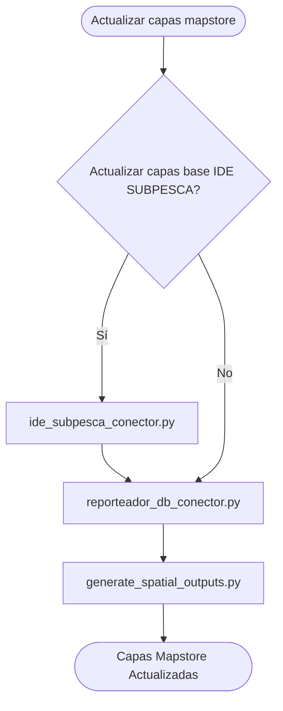

# README

Set de códigos para la extracción y procesamiento de tablas y capas espaciales provenientes de distintas bases de datos y servicios de mapas mediante lenguaje Python y SQL. En base a la información extraída se generan nuevas capas espaciales en una BD Postgres, la cual se conecta a Geoserver y se despliega en mapstore.

## Flujo de información

El flujo de ejecución de los scripts se especifica a continuación:



### 1. ide_subpesca_conector.py

Extrae la capa espacial de centros de cultivo proveniente de un servicio de mapas mediante la API REST de ArcGIS Server. Esta capa es procesada y almacenada en la BD Postgres conectada a Geoserver. Se ejecuta sólo en caso de querer actualizar la información base a desplegar en Mapstore.

Para ejecutar se ingresa cómo parámetro:

```bash
python ide_subpesca_conector.py <config.json path>
```

### 2. reporteador_db_conector.py

Genera una conexión a la la BD SQL Server de SERNAPESCA y ejecuta procedimientos almacenados para extraer las tablas:
- Existencias Moluscos
- Existencias Salmónidos
- Áreas PSMB
- Centros PSMB
- Estaciones de Monitoreo

Estas tablas son copiadas a la BD Postgres conectada a Geoserver y son pre-procesadas dentro de esta misma BD. 

**IMPORTANTE: Para poder generar la conexión a la BD de SERNAPESCA hay que estar conectado a su VPN o bien ejecutar el script desde su servidor.**

Para ejecutar se ingresa cómo parámetro:

```bash
python reporteador_db_conector.py <config.json path>
```

### 3. generate_spatial_outputs.py

Ejecuta un script SQL en la BD Postgres conectada a Geoserver para generar las tablas de salida que están desplegadas en mapstore:
- areas_contingencia
- areas_psmb
- centros_acuicultura
- centro_causal
- centros_no_psmb
- centros_psmb
- centros_tara
- centros_salmonidos

Para ejecutar se ingresa cómo parámetro:

```bash
python generate_spatial_outputs.py <config.json path>
```
