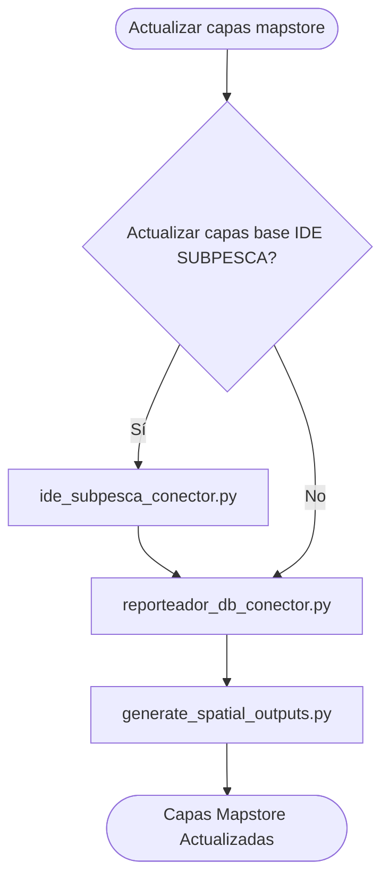

## reporteador_db_conector

*Hay que estar conectado a la VPN de SERNAPESCA*


Para ejecutar se ingresa cómo parámetro:
```bash
python reporteador_db_conector.py <config.json path>
```



```mermaid
flowchart TD
  A([Actualizar capas mapstore]) --> B{Actualizar capas base IDE SUBPESCA?};
  B -- Sí --> C[ide_subpesca_conector.py];
  C --> D[reporteador_db_conector.py];
  B -- No --> D;
  D --> F[generate_spatial_outputs.py];
  F --> G([Capas Mapstore Actualizadas]);
```
